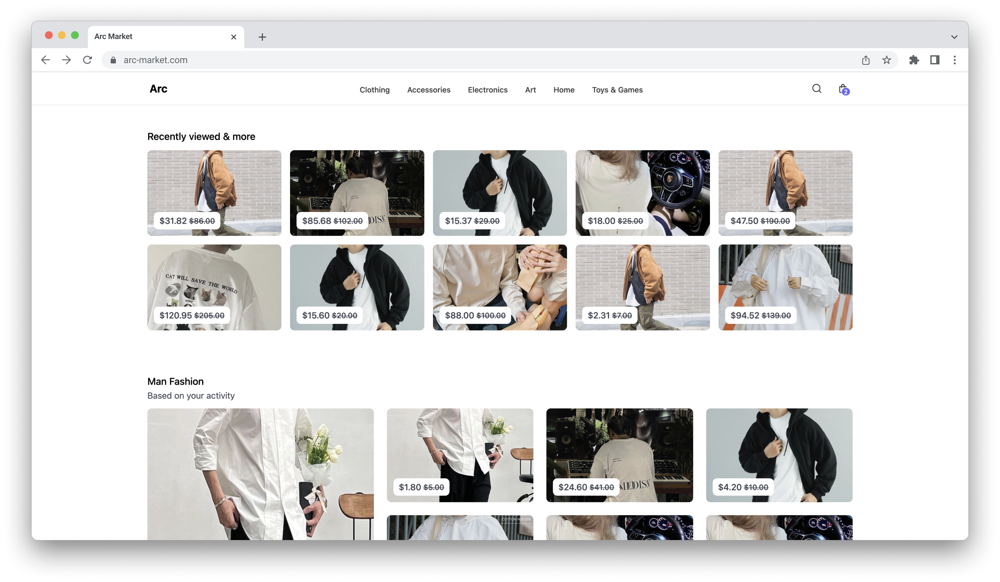

# Arc
A ecommerce marketplace web application  where people come together to make, sell, buy, and collect unique items

## Tech stack

#### Frontend:
- [Nuxt.js](https://nuxt.com/) - Vue Framework
- [Vue Query](https://tanstack.com/query/latest/docs/framework/vue/overview) - Managing and caching asynchronous data
- [Pinia](https://pinia.vuejs.org/) - State management
- [Typescript](https://www.typescriptlang.org/) - Static Type Checking
- [Tailwind](https://tailwindcss.com/) - Utility-first CSS framework
- [Zod](https://zod.dev/) - TypeScript-first schema declaration and validation
- [Vitest](https://vitest.dev/) - Testing Framework

#### Backend:
- [Express.js](https://expressjs.com/) - Node.js
- [MongoDB](https://www.mongodb.com/) - NoSQL
- [JSON Web Tokens](https://jwt.io/) - Authenticate
- [Stripe](https://stripe.com/) - Payment
- [Redis](https://redis.io/) - Distributed lock
- [AWS S3](https://aws.amazon.com/pm/serv-s3/) - Cloud Object Storage
- [Typescript](https://www.typescriptlang.org/)
- [Zod](https://zod.dev/)

## Features
- Log in, register, log out, reset password
- Create shop
- Create, get list, delete product, coupon by shop
- Search, filter products by category
- CRUD products on cart
- Checkout now or checkout with multiple products in cart
- CRUD Account's address
- Pay via cash/card
- Change currency

## Contact

For any inquiries or feedback, feel free to contact [me](mailto:dauphaihau@gmail.com).

Happy coding! 🚀
